# candL 

An institutional-grade NSE market analytics app. Self-hosted, end-of-day, and free — built for traders and analysts who want professional data depth.

---

## Overview

candL pulls raw data directly from NSE public archives, processes it into a local DuckDB database, and serves it through a React frontend styled after an institutional trading terminal. Everything runs on your machine — no API keys, no third-party data vendors, no recurring costs.

A startup sync runs automatically on launch. It checks which dates are missing, downloads all file types for those dates, and processes them into the database before the server comes up. On the first run this builds your full history from `SYNC_START_DATE`. Every subsequent run is near-instant — only new trading days are fetched.

---

## What's Inside

| Page | Coverage |
|---|---|
| **Options** | Strike-level OI / Volume / OI Change, Max Pain, PCR, time-series, daily expiry snapshots, ticker cross-section, multi-cycle OI charts |
| **Futures** | Market screener with quadrant signals, rolling session analytics, cost of carry, basis, OI charts across cycles |
| **Stocks** | OHLCV + delivery %, relative volume, 500-stock daily screener, delivery leaders |
| **Market** | Index OHLC + history, market breadth, top stocks by value, gainers/losers, FII derivatives stats, EWMA volatility |
| **Participants** | FII/DII/Client/Pro net OI, net volume, options positioning, flow classification, analysis tables |
| **FII** | Full FII activity by instrument, net OI/volume charts, stats explorer with multi-instrument comparison |

---

## Architecture

```
candL/
├── api/                    # FastAPI backend
│   ├── routes/             # One router per domain
│   └── db.py               # DuckDB connection layer
├── pipeline/
│   ├── downloader.py       # NSE archive fetchers + validators
│   ├── manifest.py         # Per-date download/process state tracking
│   ├── processors/         # Raw file → structured DB ingestion
│   ├── startup_sync.py     # Orchestrates the full sync pipeline
│   └── trading_dates.py    # Determines which dates need syncing
├── frontend/               # React + Vite + Recharts
│   └── src/pages/          # Options, Futures, Stocks, Market, Participants, FII
├── config.py               # Central configuration (edit before first run)
└── data/nse.db             # DuckDB — created automatically
```

**Data flow:**

```
NSE Archives → downloader.py → raw files on disk → processors → DuckDB → FastAPI → React
```

The pipeline runs per file type and per date. Each step is tracked independently in a CSV manifest, so partial runs, interrupted syncs, and reruns are all safe — nothing gets double-processed, nothing silently skips.

---

## Prerequisites

- Python 3.11+
- Node.js 18+
- ~2–8 GB disk space depending on your `SYNC_START_DATE` and how long you run it

---

## Installation

### 1. Clone

```bash
git clone https://github.com/yourusername/candL.git
cd candL
```

### 2. Python dependencies

```bash
pip install -r requirements.txt
```

### 3. Frontend dependencies

```bash
cd frontend
npm install
cd ..
```

### 4. Configure

Open `config.py` and set your sync start date before the first run:

```python
# How far back to pull data.
# Further back = longer initial sync and more disk space.
# 6–12 months is a reasonable starting point.
SYNC_START_DATE = "2024-08-01"

# Run the sync pipeline automatically on every startup.
SYNC_ON_STARTUP = True
```

Optionally create a `.env` file in the project root:

```env
SYNC_ON_STARTUP=True
DB_FILE=nse.db
CORS_ORIGINS=http://localhost:5173,http://localhost:8000
```

### 5. Run

**Windows:**
```bash
run.bat
```

**Mac / Linux:**
```bash
# Terminal 1 — backend
uvicorn api.main:app --host 127.0.0.1 --port 8000

# Terminal 2 — frontend
cd frontend && npm run dev
```

Open `http://localhost:5173`.

On first launch the sync will download and process all NSE data from your configured start date. Depending on the range and your connection speed, this takes anywhere from a few minutes to a couple of hours. Every subsequent startup syncs only new dates and completes in seconds.

---

## Features

### Options

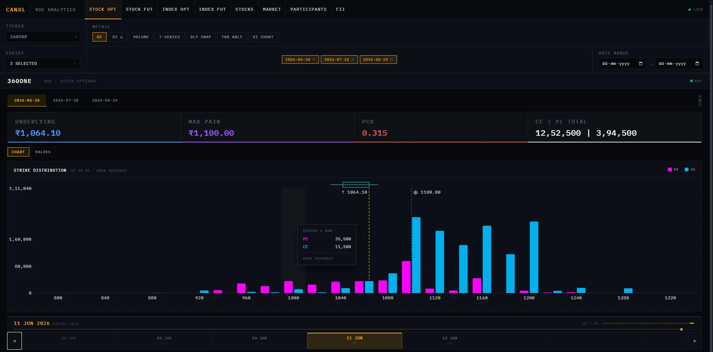

The OI view renders a strike-level bar chart for calls and puts side by side. The Y-axis scale is locked across all dates in the selected range so you can scrub the date slider and directly compare OI buildup or unwinding at each strike over time. The ATM strike is highlighted automatically based on the underlying price. An OHLC price overlay sits on top of the chart.

Metric switcher covers Open Interest, OI Change, and Volume. Each renders its own chart with the appropriate locked scale.

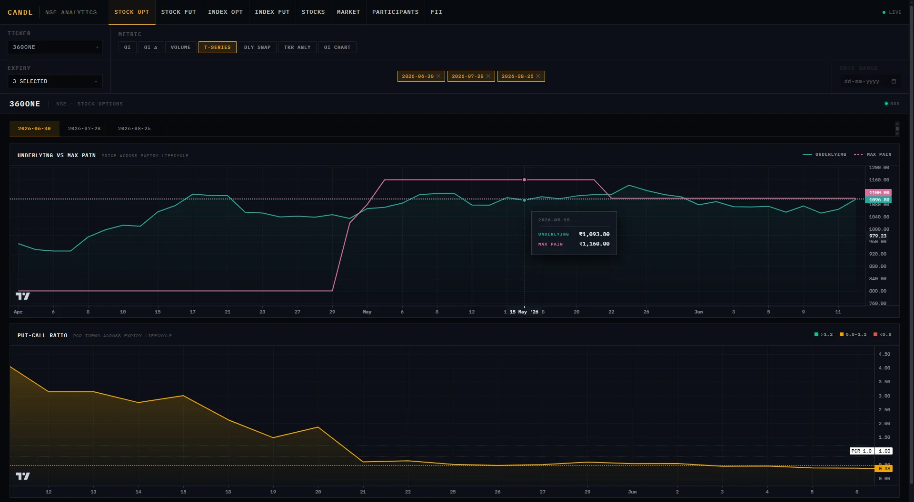

The Time Series view plots Max Pain and the underlying price on the same axis across the full expiry cycle, with a separate PCR chart below. This makes it easy to see how Max Pain migrated as the cycle progressed and whether the price converged toward it near expiry.

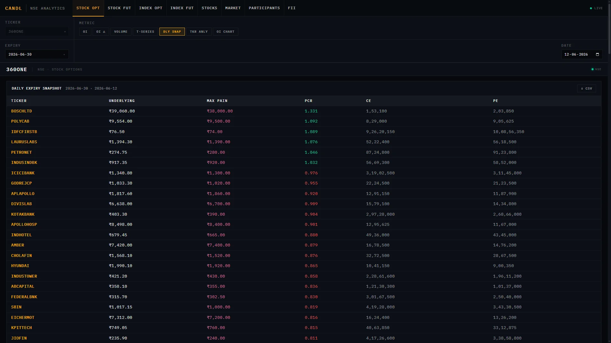

The Daily Expiry Snapshot is a market-wide cross-section: pick any expiry and any date, and get Max Pain, PCR, CE total, and PE total for every ticker in the F&O segment simultaneously. Exportable to CSV.

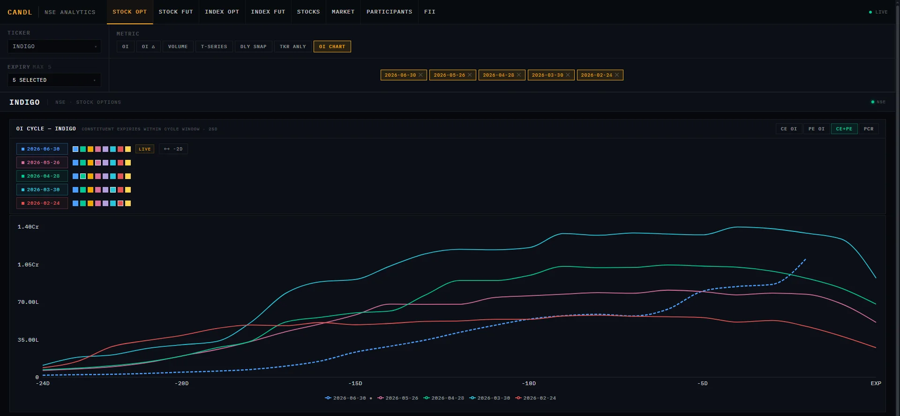

The OI Charts mode plots cumulative OI across up to five expiry cycles on a single chart, letting you compare current cycle build-up against historical ones - available for both futures and options.

---

### Futures

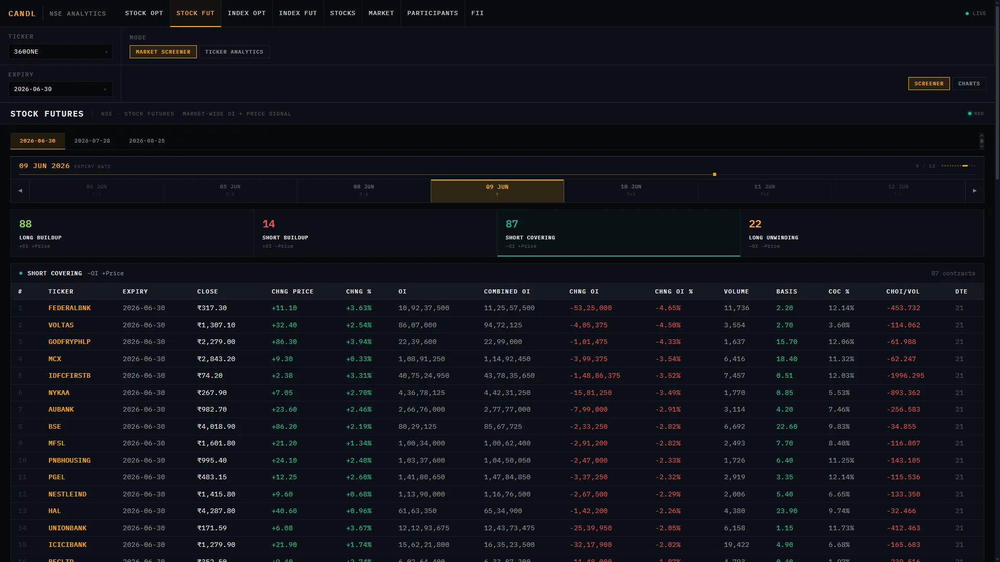

The Market Screener gives a market-wide snapshot of every F&O future on a selected date, classified into four quadrants based on price and OI direction:

| Quadrant | Signal |
|---|---|
| Long Buildup | Price ↑, OI ↑ |
| Short Buildup | Price ↓, OI ↑ |
| Short Covering | Price ↑, OI ↓ |
| Long Unwinding | Price ↓, OI ↓ |

The summary cards at the top show the count of contracts in each quadrant. Clicking a quadrant shows the full ranked table for that signal, including expiry, close, OI, change in OI, volume, basis, cost of carry, and ChOI/Vol ratio. A date slider lets you step through history one session at a time.

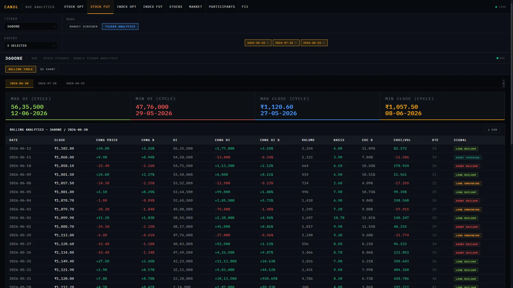

Ticker Analytics drills into a single contract across its full cycle. Every session is a row: close, price change, OI, OI change, volume, basis, cost of carry, ChOI/Vol, days to expiry, and a quadrant signal badge. Metric cards at the top surface the cycle high/low for both OI and price. Exportable to CSV.

---

### Stocks

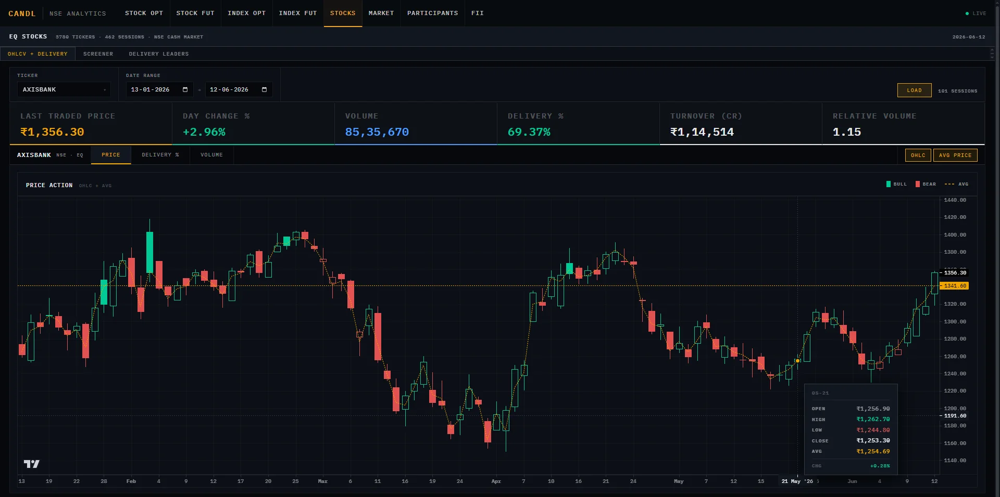

The OHLCV view renders a candlestick chart (toggleable to line) with an optional average price overlay. Below it sits a delivery % bar chart with MA5/MA20, and a relative volume chart showing each session's volume against the 20-day average. High relative volume bars are highlighted in amber.

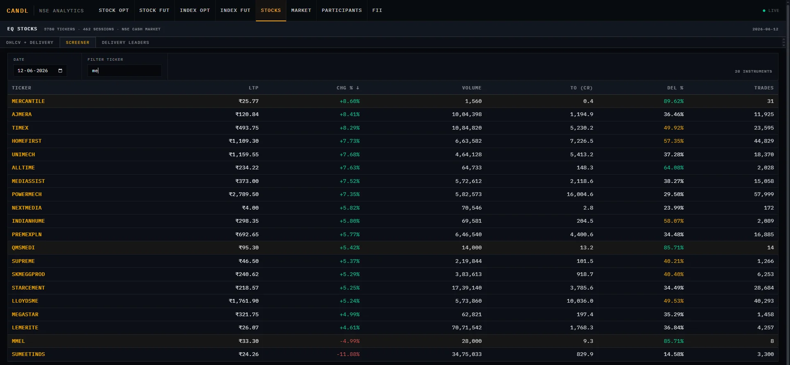

The Screener loads up to 500 NSE EQ instruments for any date, sortable by any column — LTP, change %, volume, turnover, delivery %, trade count. Rows with delivery above 70% are highlighted as a conviction signal.

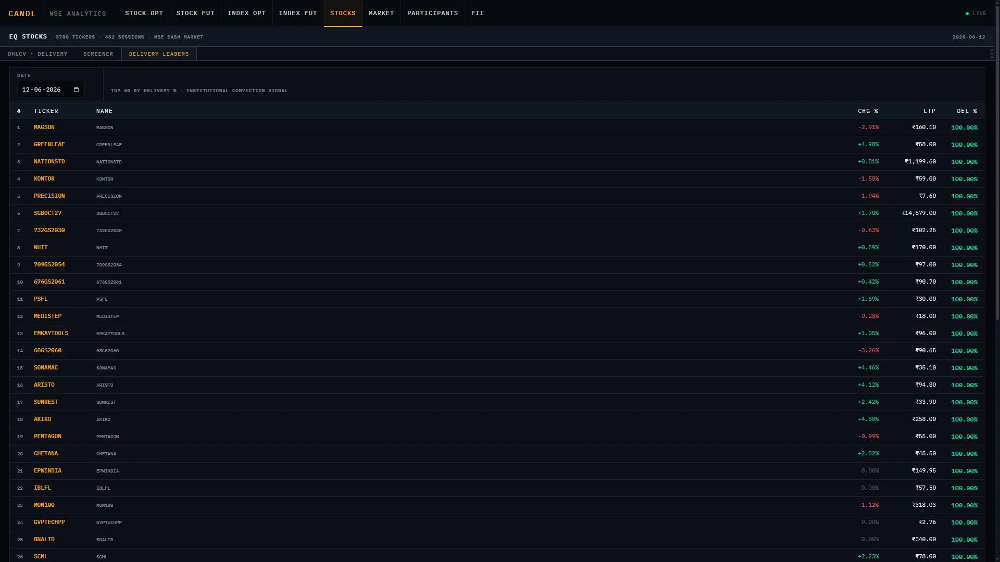

Delivery Leaders ranks the top 50 stocks by delivery percentage for the selected session, with a proportional background bar on each row so relative strength is visible at a glance.

---

### Market

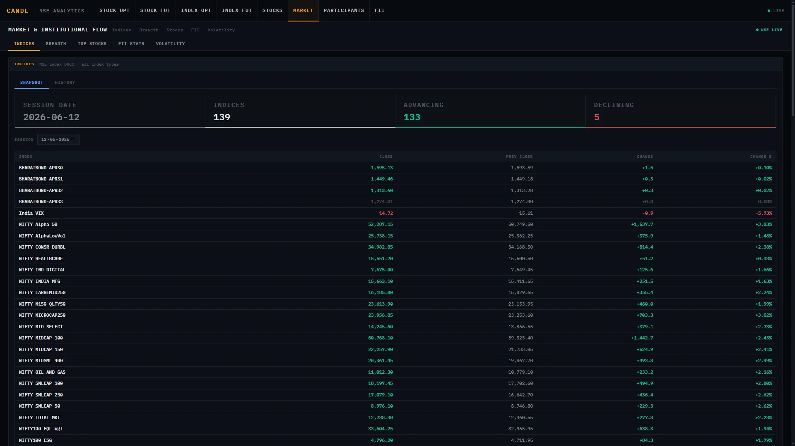
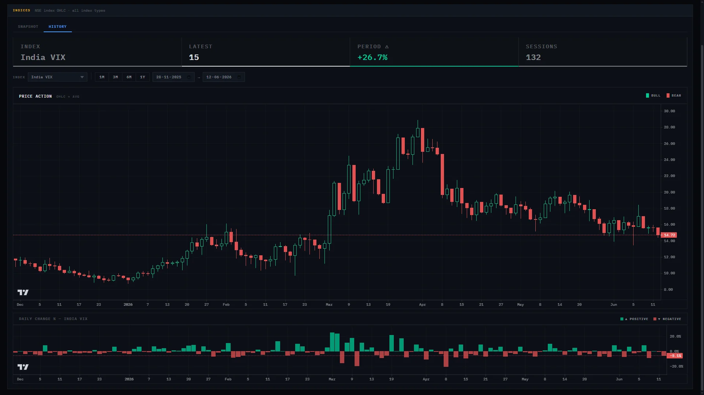

The Indices tab covers both a snapshot view (all NSE indices for a selected date — close, prev close, change, change %) and a historical chart view with candlestick OHLC and a daily change % bar chart below.

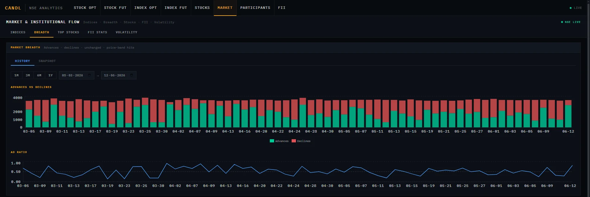

Market Breadth plots advances, declines, and the AD ratio over a selected date range. The snapshot sub-tab shows the latest session's counts alongside the price band hits count.

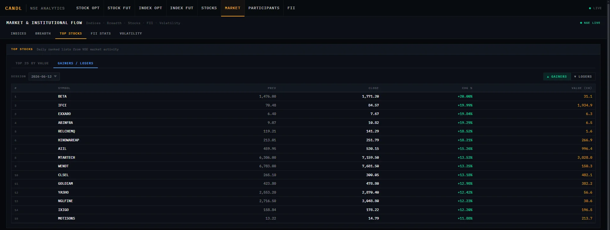

Top Stocks surfaces the 25 highest-turnover instruments for any session. The Gainers/Losers sub-tab shows the top 15 on each side filtered by a minimum turnover threshold, removing low-liquidity noise.

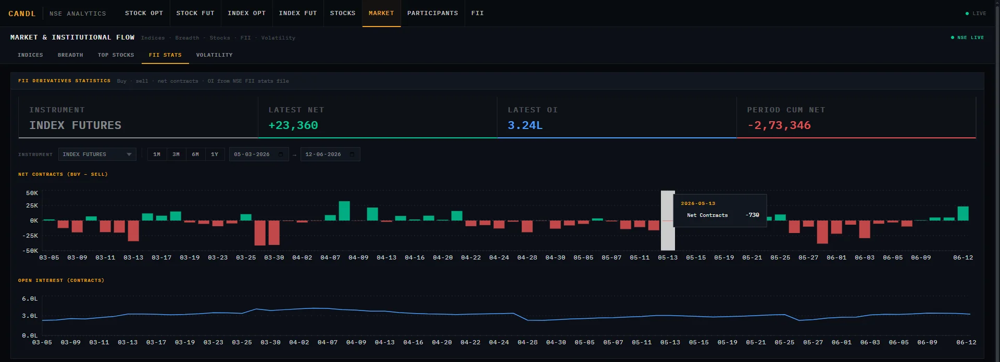

FII Stats plots net contracts (buy minus sell) and open interest over time for any instrument category — index futures, index options, stock futures, stock options. Filter by instrument and date range.

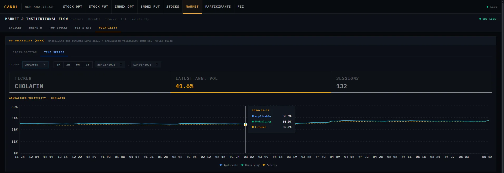

The Volatility tab serves NSE's FOVOLT data: EWMA daily and annualised volatility for underlying and futures across all F&O instruments. The cross-section view ranks all tickers by annualised vol on a selected date. The time series view plots applicable, underlying, and futures vol for any single ticker over a custom range.

---

### Participants

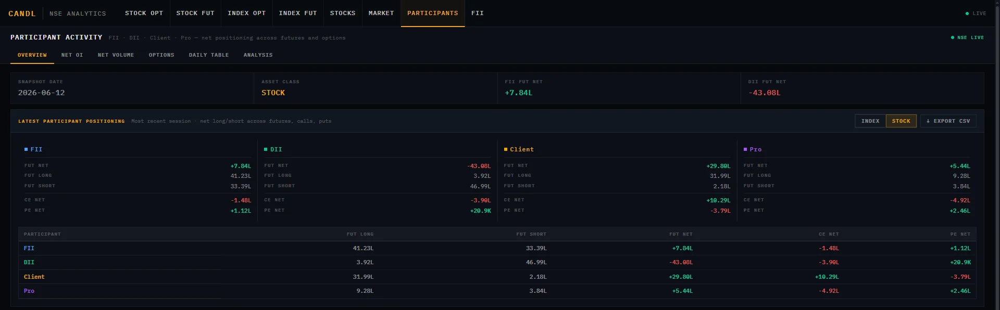

The Overview tab shows the most recent session's net long/short positioning for FII, DII, Client, and Pro across futures, calls, and puts — split by Index and Stock asset class. Each participant gets a summary card and a row in the full breakdown table.

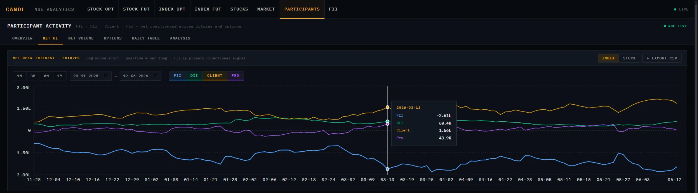

Net OI plots the futures net position (long minus short) for each participant type over time. Toggle individual participants on and off. Covers index and stock asset classes separately.

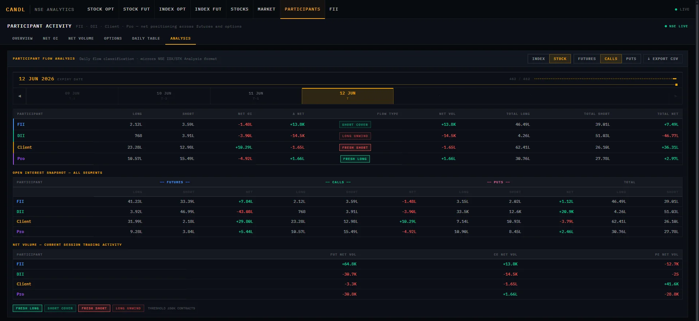

The Analysis tab is the deepest view: it computes the day-over-day change in net OI for each participant and classifies it as Fresh Long, Short Cover, Fresh Short, or Long Unwind — matching the NSE IDX/STK Analysis format. Three stacked tables show the flow classification, a full all-segments OI snapshot, and net volume for the session.

---

### FII

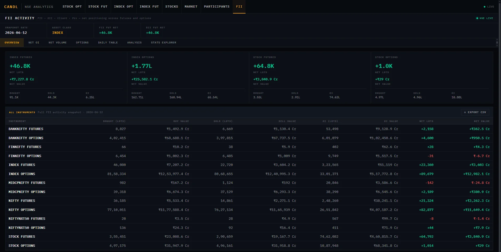

The Overview tab aggregates FII activity into four groups (Index Futures, Index Options, Stock Futures, Stock Options) with net lots and net value for the latest date, plus a full instrument breakdown table below.

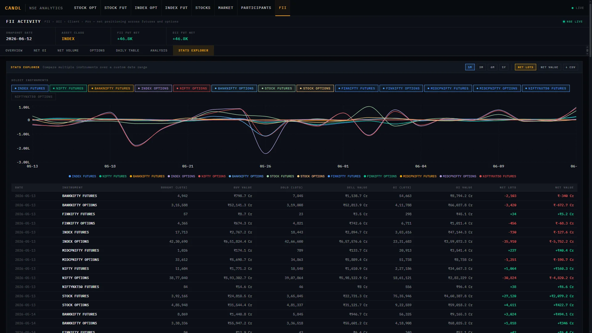

The Stats Explorer lets you select any combination of instruments and plot their net lots or net value over a custom date range on the same chart. Toggle instruments on and off, switch between lots and value, and export to CSV. This is the most flexible view for building a custom picture of FII flow.

---

## How the Sync Pipeline Works

On every startup, `startup_sync.py` runs in two phases:

**Phase 1 — Download.** It computes which trading dates are missing from the manifest and fetches all eight file types for each one from NSE archives: F&O bhavcopy, equity bhavcopy (EQ series and CM series), FII statistics, participant OI, participant volume, EWMA volatility, and market activity. Each file type has its own URL builder, response validator, and output path under `raw/`. Results are written to disk and the manifest is updated per file type, per date. If a file returns 404 and it's not today, it's marked `market_closed` and skipped cleanly on future runs.

**Phase 2 — Process.** For each downloaded-but-unprocessed date, the corresponding processor runs and ingests data into DuckDB. Processing is also tracked per file type in the manifest, so if a processor fails mid-run, only that file type for that date will retry — nothing else re-runs unnecessarily.

The manifest is a plain CSV at `raw/manifest.csv`. Every row is a trading date. Every column is a download or process flag. You can open it in any spreadsheet to see exactly what has been fetched and processed.

---

## Data Sources

All data is fetched from publicly available NSE archives. No API keys required.

| File type | Source path pattern |
|---|---|
| F&O bhavcopy | `nsearchives.nseindia.com/content/fo/BhavCopy_NSE_FO_*` |
| Equity bhavcopy (EQ) | `nsearchives.nseindia.com/products/content/sec_bhavdata_full_*` |
| CM bhavcopy | `nsearchives.nseindia.com/content/cm/BhavCopy_NSE_CM_*` |
| FII statistics | `nsearchives.nseindia.com/content/fo/fii_stats_*` |
| Participant OI | `nsearchives.nseindia.com/content/nsccl/fao_participant_oi_*` |
| Participant volume | `nsearchives.nseindia.com/content/nsccl/fao_participant_vol_*` |
| F&O EWMA volatility | `nsearchives.nseindia.com/archives/nsccl/volt/FOVOLT_*` |
| Market activity | `nsearchives.nseindia.com/archives/equities/mkt/MA*` |

---

## Database Schema

candL uses DuckDB (`data/nse.db`), created automatically on first run.

| Table | Description |
|---|---|
| `instruments` | Master reference for all F&O and equity instruments — ticker, expiry, strike, option type, lot size, series |
| `market_data_daily` | OHLCV, OI, delivery data keyed by `(trade_date, instrument_key)` |
| `options_analytics` | Computed per-expiry metrics: PCR, Max Pain, CE/PE OI — keyed by `(instrument_type, ticker, expiry, trade_date)` |
| `futures_analytics` | Computed futures metrics: close, OI, CoC, basis, ChOI/Vol, quadrant signal |
| `participant_activity` | FII/DII/Client/Pro long/short contracts across futures and options, both OI and volume |
| `fii_stats` | FII buy/sell/OI by instrument type |
| `fo_volatility` | EWMA daily and annualised volatility for underlying and futures per ticker |
| `market_activity_index` | NSE index OHLC for all index types |
| `market_activity_breadth` | Daily advances, declines, unchanged, price band hits |

---

## Configuration Reference

All settings live in `config.py`. Most have sensible defaults — only `SYNC_START_DATE` needs to be set before the first run.

| Setting | Default | Description |
|---|---|---|
| `SYNC_START_DATE` | `"2024-08-01"` | **Set this before first run.** Earliest date to fetch. |
| `SYNC_ON_STARTUP` | `True` | Run the sync pipeline when the server starts |
| `API_HOST` | `127.0.0.1` | FastAPI bind address |
| `API_PORT` | `8000` | FastAPI port |
| `DB_FILE` | `nse.db` | Database filename (overridable via `.env`) |
| `NSE_DB_PATH` | `data/nse.db` | Full path to DuckDB file |
| `CORS_ORIGINS` | `localhost:5173, :8000` | Allowed frontend origins |

---

## API

The backend exposes a versioned REST API at `http://localhost:8000/api/v1`. Interactive docs (Swagger UI) are available at `http://localhost:8000/docs` when the server is running.

Sample endpoints:

```
GET /api/v1/options/tickers
GET /api/v1/options/{asset_type}/{ticker}/expiries
GET /api/v1/options/{asset_type}/{ticker}/{expiry}/snapshot?date=YYYY-MM-DD
GET /api/v1/futures/{asset_type}/rollup?date=YYYY-MM-DD
GET /api/v1/stocks/ohlc?ticker=RELIANCE&start=2024-01-01&end=2024-12-31
GET /api/v1/participant/net-oi?start=...&end=...&asset_class=INDEX
GET /api/v1/fii/stats?start=...&end=...
```

---

## Notes

- **This is an end-of-day platform.** It does not stream live tick data. NSE uploads bhavcopy and participant files after market close, typically by 19:00–20:00 IST. Run the app the next morning and the previous day's data will be available.
- **Market holidays** are handled gracefully. If NSE returns a 404 for a given date, it is marked `market_closed` in the manifest and never retried.
- **Large initial syncs.** Going back more than a year will take time on first run. The downloader is sequential to be respectful of NSE's servers. Let it run — progress prints to the console.
- **File validation.** The downloader validates each file's internal date before writing it to disk. Stale or malformed responses are rejected and marked accordingly in the manifest rather than silently corrupting the database.

---

## Tech Stack

**Backend:** Python · FastAPI · DuckDB · Pandas · Requests

**Frontend:** React · Vite · Recharts · IBM Plex Mono

**Pipeline:** Custom download/process registry with manifest-based state tracking per file type per date